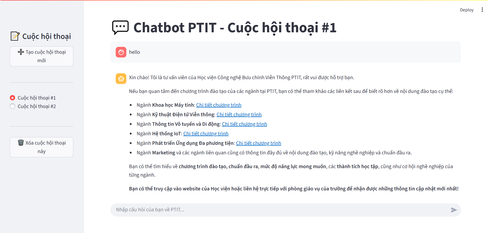
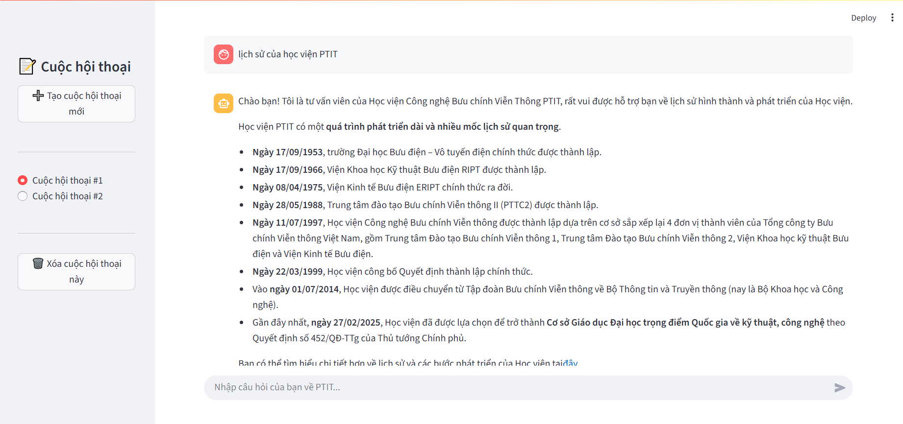
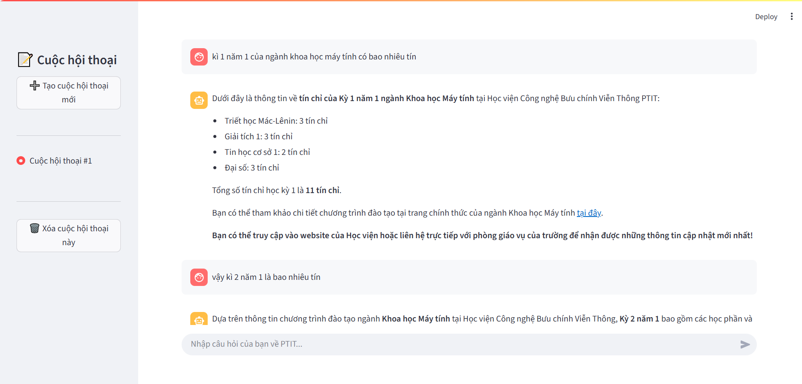
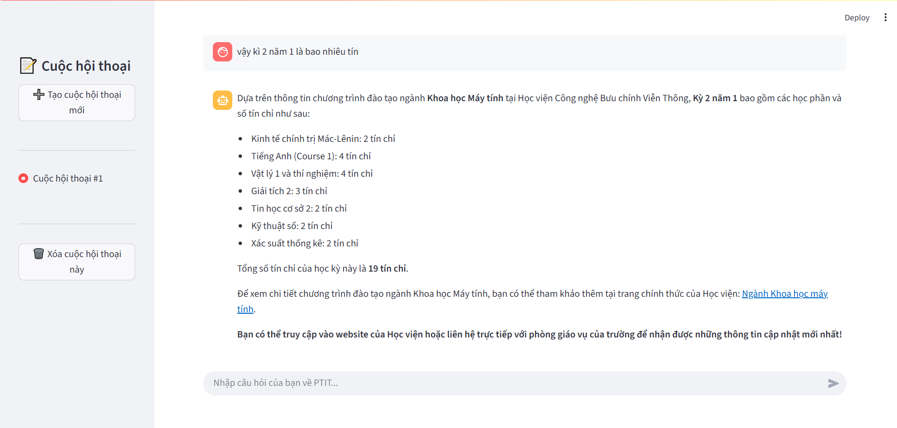
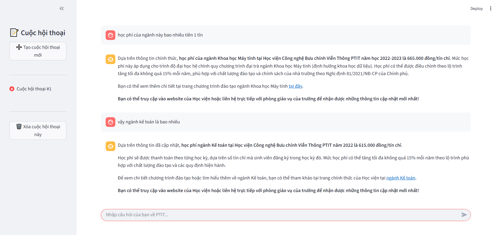
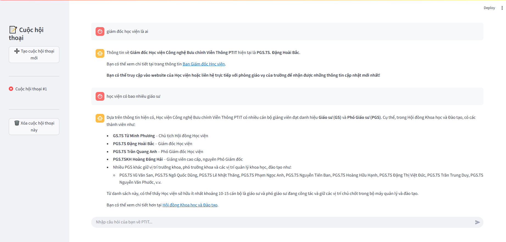

# Chatbot PTIT

## Introduction

This project is a student consulting chatbot designed for the Posts and Telecommunications Institute of Technology (PTIT). It leverages Retrieval-Augmented Generation (RAG) with vector databases to provide accurate and up-to-date information for students. The chatbot can answer questions related to PTIT such as academic programs, tuition fees, internship schedules, organizational structure, and general student support. Its goal is to make information more accessible and improve the student experience at PTIT.

## Overview







## Features
- **Data Crawling & Preprocessing** - crawl data from PTIT pages, then preprocess the data, and finally chunk it into segments
- **PTIT Q&A Chatbot** – answers user queries about smartphones.  
- **Advanced RAG System** – uses LangChain to fetch relevant information from databases.  
- **Query Rewrite** – rewrite queries based on chat history.  
- **Hybrid Search** – combines:
  - **Semantic search (vector embeddings in Milvus)**  
  - **Keyword search (BM25)**  
- **PostgresSQL** – Based on the list of ids retrieved from Milvus, get text from PostgresSQL 
- **Streaming LLM Responses** – tokens are streamed back to the frontend as soon as they are generated.
- **Streamlit Web UI** – simple and interactive chat interface.  
- **FastAPI Backend** – provides REST APIs for chatbot and data retrieval.  
- **Scalable Database Design** – hybrid of vector DB (Milvus) + relational DB (Postgres).  
- **Modular Architecture** – backend/frontend separation for flexibility.  

## Tech Stack

**Crawl:**
- [BeautifulSoup] - used for web scraping PTIT websites to collect academic and organizational information

**Frontend:**  
- [Streamlit] – UI framework for chatbot interface  

**Backend:**  
- [FastAPI] – high-performance API framework  

**Databases:**  
- [Milvus] – vector database for embeddings + hybrid search  
- [SQL] – relational database for structured queries  

**Core AI / NLP:**  
- [LangChain] – framework for Retrieval-Augmented Generation (RAG)  
- Embedding Models – used for semantic search in Milvus (use model of OpenAI)
- LLM - use API of OpenAI

## Installation

1. **Clone the repository**:
   ```
   git clone https://github.com/Bo2874/PTIT_chatbot.git
   cd chatbot_ptit
   ```

2. **Create a virtual environment**:
   ```
   python -m venv venv
   source venv/bin/activate  # On Windows: venv\Scripts\activate
   ```

3. **Install dependencies**:
   ```
   pip install -r requirements.txt
   ```

4. **Set up Databases**:
   - **Milvus**: Run Milvus via Docker:
     ```
     docker run -d -p 19530:19530 -p 19121:19121 milvusdb/milvus:latest
     ```
     Connect via the SDK in the code.
   - **PostgreSQL**: Run via Docker:
     ```
     docker run -d -p 5432:5432 -e POSTGRES_PASSWORD=yourpassword -e POSTGRES_DB=POSTGRES_DB postgres:latest
     ```
     Create schema and import data (e.g., phone product table).

5. **Configure Environment**:
   Create a `.env` file with the following variables:
   ```
   OPEN_API_KEY = YOUR_OPEN_API_KEY
   ```

## Running the Application

1. **Run the Backend (FastAPI)**:
   ```
   cd app
   uvicorn main:app --reload
   ```
   The API will be available at `http://localhost:8000`. Main endpoints:
   - `/query`: Handles chatbot queries (POST with query in body).

2. **Run the Frontend (Streamlit)**:
   ```
   cd web
   streamlit run app.py
   ```
   Access at `http://localhost:8501` to interact with the chatbot.

3. **Usage**:
   - Enter a PTIT-related question (e.g., "Học phí ngành khoa học máy tính").
   - The chatbot uses RAG: performs hybrid search in Milvus, combines with SQL queries in PostgreSQL, and generates a response.